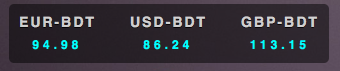
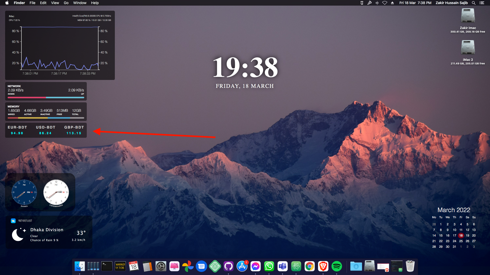

# bdt-currency-converter.widget

## Author: Zakir Sajib
## Email: zakirsajib@gmail.com

## In Action

This widget is using <strong>exchangeratesapi</strong> api to get currency and convert them into Bangladesh Taka (BDT). Currently it has <strong>Euro, USD and GBP</strong> currency. You can add as many as you want.

To use this widget you need an api key from <strong>exchangeratesapi.io</strong> which is free.

This widget is tested on <strong>high sierra</strong> and <strong>big sur</strong> with iMac and Macbook Pro 2011 model. This widget is highly customizable in terms of Style, Code.

<https://exchangeratesapi.io/>
